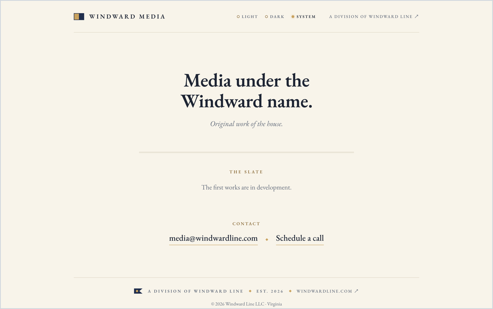

# media.windwardline.com

Windward Media, the production division of Windward Line — renamed from
Windward Creative so the division is never boxed into one medium. Original
work of the house; the first works are in development.

Static site, no build step: two HTML pages (the masthead and `/schedule`,
which embeds the division's Koalendar booking page), one stylesheet,
self-hosted EB Garamond, the division signal flag (Kilo — "I wish to
communicate with you") as inline SVG, and the lamp (light / dark / system). Design
spec: [docs/superpowers/specs/2026-07-27-media-masthead-slate-design.md](docs/superpowers/specs/2026-07-27-media-masthead-slate-design.md).

Deployed on Vercel; DNS on Cloudflare. Pushes to `main` deploy to production.
Security headers are set in [vercel.json](vercel.json).

The code and text here are proprietary ([LICENSE](LICENSE)). EB Garamond is
not: it ships under the SIL Open Font License 1.1, and its copyright notice and
license text travel with the fonts in [fonts/OFL.txt](fonts/OFL.txt).
